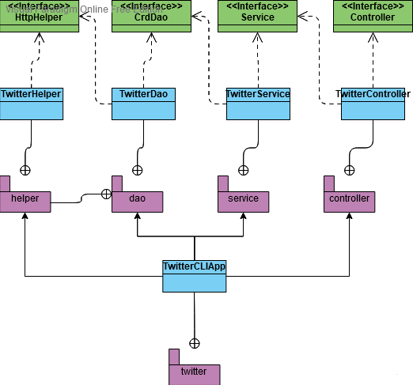

# Introduction
The Java application uses a bottom-up approach that can CRUD(create, read and delete) tweets from the CLI via the Twitter REST API. A Java library is also implemented to process the Twitter API; as the Twitter API returns data in the form of JSON. Junit and Mockito were used as testing tools, IntelliJ was used as a IDE and source code control was performed through git. Also, Maven was used to package and manage dependencies then Dockerized and pushed to Docker Hub for easier user consumption.

# Quick Start
Package Maven
```
mvn clean
mvn package -Dmaven.test.skip
```

Run Application with Docker
```
docker pull dttrumble/twitter
```
```
docker run --rm \
-e consumerKey=YOUR_VALUE \
-e consumerSecret=YOUR_VALUE \
-e accessToken=YOUR_VALUE \
-e tokenSecret=YOUR_VALUE \
dttrumble/twitter post|get|delete [options]
```
# Design
## UML diagram



## App/Main
## Controller 
## Service 
## DAO
## Models
Talk about tweet model
## Spring
- How you managed the dependencies using Spring?

# Test
How did you test you app using Junit and mockito?

## Deployment
Steps to dockerize app:

```
docker_user=docker_id
docker login
mvn clean package
docker build -t ${docker_user}/twitter .
docker push ${docker_user}/twitter
```

# Improvements
- Create document of available tweets to post.
- Automate post script to tweet every 24 hours.
- Automate post script via Google hosting service api gateway.
