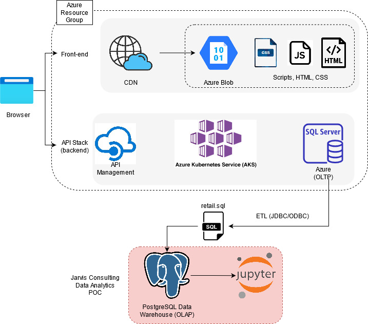

Table of Contents

* [Introduction](#introduction)
* [Implementation](#implementation)
* [Improvements](#improvements)


# Introduction


The purpose of this project is to support London Gift Shop (LGS) through data analytics, which is a UK-based online store that sells gift-ware. The LGS marketing team wants to utilize the latest data technologies to understand their customers better to develop sales and marketing techniques. Upon delivering this proof of concept (POC) project, it will be used by the LGS marketing team to analyze customer shopping behaviour. Technologies used in this project include: Docker, Postgres, Jupyter Notebook, Python libraries and Pandas Dataframe. 


# Implementaion

## Dataset


[Dataset](./python_data_wrangling/data/online_retail_II.csv)


```
Invoice
StockCode
Description
Quantity
Invoice Date
Price
Customer ID
Country
```

1. Total Invoice Amount Distribution (Invoice Amount/ Remove Outliers)
2. Monthly Placed and Canceled Orders
3. Monthly Sales
4. Monthly Sales Growth
5. Monthly Active Users
6. New and Existing Users
7. Finding RFM
8. RFM Segmentation


### Analytics Work


### Architecture


As per request, the LGS IT team dumped the transaction data between 01/12/2009 and 09/12/2011 into a sql/csv file, which is shared with the Jarvis team. With this, a Docker container was provisioned with Postgres, which was then integrated with Jupyter Notebook to unify this projects analytics workloads. The Retail Data Analytics csv and sql file were used to create a dataframe to analyze the data files and create vizual representations of queried results.


### Architecture Diagram




## Data Analytics and Wrangling

[Retail Data Analytics Notebook](./python_data_wrangling/Retail_Data_Analytics.ipynb)

<b>Sales / Sales Growth:</b> The visual representation shows that both sales and sales growth go through a series of peaks and troughs. With this, it is easier to predict when the next peak or trough will be.

<b>Users:</b> The number of users correspond with the sales and sales growth peaks. To garner more sales peaks, it will be important to commit more efforts to active and new users.

<b>RFM and Segmentation:</b> Through RFM and Segmentation it can provide deep insight as to what interests the highest paying customers. Also, it describes the spending habits of the least impressionable users.


# Improvements
- Create different visualization and plotting graphs to better represent the data.
- Use more effective analytics solutions that can produce query results with less lines of code.
- Try more creative and ambitious analysis, metrics and models. 
