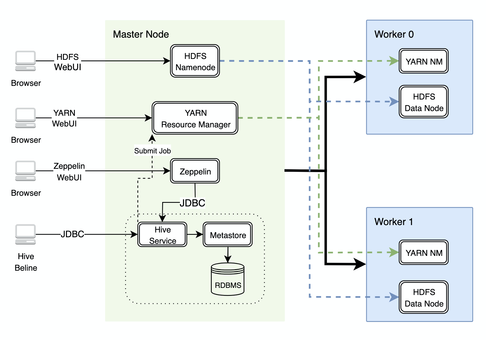

Table of Contents

* [Introduction](#introduction)
* [Databricks and Hadoop Implementation](#databricks-and-hadoop-implementation)
* [Zeppelin and Hadoop Implementation](#zeppelin-and-hadoop-implementation)
* [Future Improvement](#future-improvement)


# Introduction
The purpose of this project is to use Data Analytics and Wrangling with Scala, Spark and Pyspark to evaluate and provide retail data strategies to business and marketing teams alike. The data was provisioned using a Master-Worker Cluster in tandem with Hadoop/ Google Cloud Platform and Azure Databricks/ Pyspark to initialize a zeppelin/ databricks notebook. Technologies include: Scala, Apache Spark, Apache Hadoop Pyspark, Microsoft Azure & Azure Databricks, Google Cloud Platform, Hadoop and Zeppelin.


# Databricks and Hadoop Implementation


## Dataset

Dataset and Notebook


## Analytics Work


## Architecture


## Architecture Diagram


# Zeppelin and Hadoop Implementation


## Dataset

Dataset and Notebook

```
year			integer
countryname		string
countrycode		string
indicatorname		string
indicatorcode		string
indicatorvalue		string
```
1. Show Historical GDP for Canada
2. Show GDP for Each Country and Sort By Year
3. Find the Highest GDP for Each Country


## Analytics Work


## Architecture
This aspect of the project was instantiated from a previously completed #Hadoop Project where; the purpose was to perform data analytics and process big data using Apache Hadoop and other tools such as: HDFS, YARN, Zeppelin, Hive and Spark. This project required the provisioning of a three node Hadoop cluster with GCP Dataproc service. Then a Dataset was prepared from source: Google Public Data (hosted on Google BigQuery). The Dataset was exported via the BigQuery Table to Google Storage. From which GS Data using Hive was created/ queried and Zeppelin was used to execute code. Lastly, integrating GS data to HDFS as text; as well as, continuously improving parsing and performance through the use of OpenCSVSerDe, Partition and Columnar(parquet).


## Architecture Diagram



# Future Improvement
- hardware 
- hardware
- hardware
